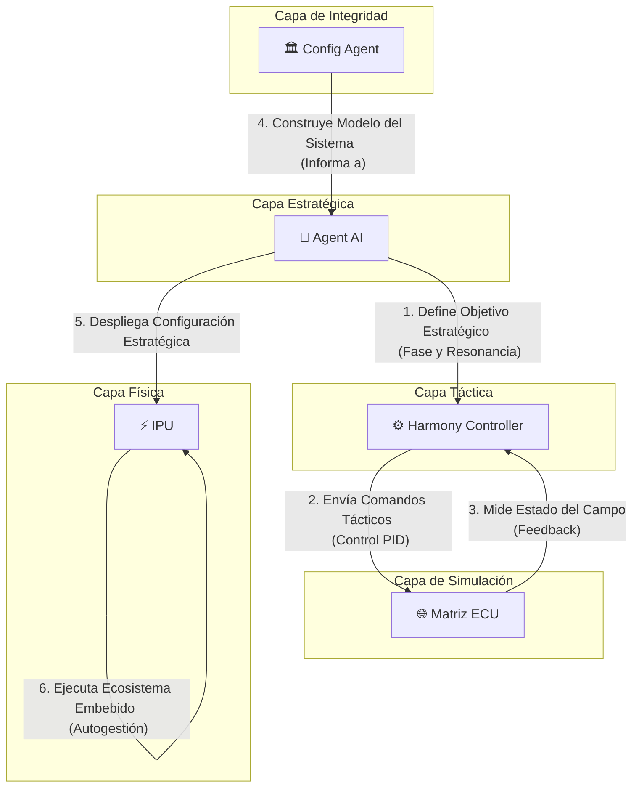

# Watchers: Un Ecosistema para la armonización de energía inteligente

## Visión del Proyecto

La visión central de **Watchers** es **armonizar el lenguaje de máquina para hacer la comunicación entre aplicaciones y entornos más intuitiva y objetiva**. Buscamos trascender las implementaciones tradicionales para crear sistemas que no solo se comuniquen, sino que se comprendan a un nivel fundamental. Nuestra primera aplicación práctica de esta visión es la creación de **sistemas de gestión de energía más eficientes, resilientes e inteligentes**, sentando las bases para un futuro energético autónomo y sostenible.

## Componentes Clave del Ecosistema

El ecosistema Watchers se organiza en una jerarquía clara, donde cada componente cumple un rol específico, desde la estrategia de alto nivel hasta la ejecución física.

### 🧠 Agent AI (El Estratega)

**Agent AI** es el cerebro de alto nivel del sistema. Su función es tomar decisiones estratégicas basadas en el estado general del ecosistema y los objetivos a largo plazo. No se ocupa de la microgestión, sino de definir la "intención" del sistema.

- **Gestión Estratégica:** En su nueva capacidad, Agent AI gestiona conceptos avanzados como la **"fase cuántica"** y la **"resonancia"** del sistema. Estos no son parámetros de control directo, sino objetivos estratégicos que buscan una coherencia y eficiencia energética a un nivel superior, similar a cómo un director de orquesta busca la armonía perfecta en lugar de controlar cada nota individualmente.

### ⚙️ Harmony Controller (El Táctico)

El **Harmony Controller** es el ejecutor de bajo nivel que traduce las directivas estratégicas de Agent AI en acciones concretas. Funciona como el sistema nervioso, manteniendo el equilibrio en tiempo real.

- **Ejecución Táctica:** Utiliza bucles de control PID y otros mecanismos para ajustar el comportamiento de los componentes físicos. Ahora, su función se ha expandido para implementar **"tareas tácticas cuánticas"**, como la sincronización de fase y la búsqueda de resonancia, asegurando que las órdenes del Estratega se manifiesten de manera precisa en el entorno.

### 🌐 Matriz ECU (El Entorno Simulado)

La **Matriz ECU (Experiencia de campo unificado)** es el gemelo digital del entorno físico. Es un campo de simulación donde las decisiones y acciones se prueban y modelan antes de afectar al mundo real.

- **Dinámica de Campo Toroidal:** Modela el entorno como un **campo toroidal**, representando flujos de energía y sus interacciones.
- **Fase Cuántica Local:** Su nueva capacidad más importante es la **"fase cuántica local"**. Esto permite que la simulación no solo refleje estados estáticos, sino que capture dinámicas complejas y comportamientos emergentes, haciendo que el gemelo digital sea mucho más rico y predictivo.

### 🏛️ Config Agent (El Arquitecto / MCP)

**Config Agent** es el guardián de la integridad y la coherencia del sistema. Su rol ha evolucionado de un simple validador de archivos a un verdadero arquitecto del sistema.

- **Model Context Protocol (MCP):** A través del MCP, Config Agent no solo valida la sintaxis de los archivos de configuración, sino que **construye un modelo conceptual del sistema**. Entiende las relaciones, dependencias y roles de cada componente.
- **Matriz de Interacción Central (MIC):** La MIC es la herramienta principal del MCP. Es una representación formal de la topología de comunicación, definiendo qué servicios pueden hablar entre sí, con qué propósito y bajo qué condiciones. Garantiza que la arquitectura sea robusta, segura y escalable.

### ⚡ IPU (La Manifestación Física)

La **IPU (Intelligent Power Unit)** es el primer producto de hardware del ecosistema Watchers. Es la materialización de nuestra visión en un dispositivo físico.

- **El Cerebro Energético:** La IPU no es un simple convertidor de potencia. Es un **"Cerebro Energético"**: una unidad autónoma que ejecuta una versión embebida de todo el ecosistema Watchers. Cada IPU contiene su propio gemelo digital (Matriz ECU) y su propia inteligencia (Agent AI y Harmony Controller), permitiéndole realizar una gestión de energía predictiva, autoconsciente y optimizada localmente, mientras se coordina con el ecosistema global.

## Arquitectura del Sistema

El siguiente diagrama ilustra la jerarquía y el flujo de comunicación entre los componentes clave del ecosistema Watchers:



## ¿Cómo Empezar?

Para poner en marcha el ecosistema de Watchers, necesitarás el siguiente software:

- **Podman & podman-compose:** Para la gestión de contenedores.
- **Python 3.10+:** El lenguaje principal del proyecto.
- **pip-tools:** Para la gestión de dependencias de Python.

## Instalación y Configuración

Sigue estos pasos para configurar tu entorno de desarrollo:

1.  **Clona el repositorio:**
    ```bash
    git clone https://github.com/tu-usuario/watchers.git
    cd watchers
    ```

2.  **Crea y activa el entorno virtual:**
    ```bash
    python -m venv venv
    source venv/bin/activate
    ```

3.  **Instala las herramientas de desarrollo:**
    ```bash
    pip install pip-tools
    ```

4.  **Compila e instala las dependencias:**
    ```bash
    pip-compile requirements-dev.in
    pip install -r requirements-dev.txt
    ```

Ahora estás listo para explorar y contribuir al ecosistema Watchers. ¡Bienvenido!
