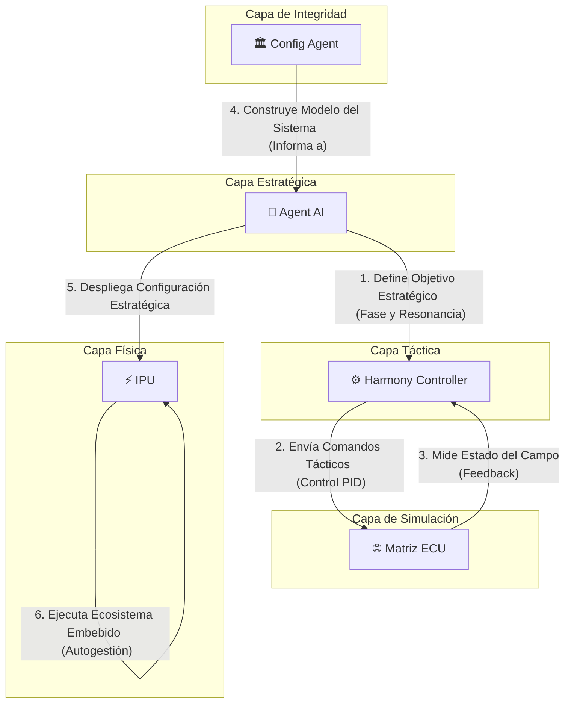

# Watchers: Un Ecosistema para la Armonización de Energía Inteligente

## Visión del Proyecto

La visión central de **Watchers** es **armonizar el lenguaje de máquina para hacer la comunicación entre aplicaciones y entornos más intuitiva y objetiva**. Buscamos trascender las implementaciones tradicionales para crear sistemas que no solo se comuniquen, sino que se comprendan a un nivel fundamental. Nuestra primera aplicación práctica de esta visión es la creación de **sistemas de gestión de energía más eficientes, resilientes e inteligentes**, sentando las bases para un futuro energético autónomo y sostenible.

## Componentes Clave del Ecosistema

El ecosistema Watchers se organiza en una jerarquía clara, donde cada componente cumple un rol específico, desde la estrategia de alto nivel hasta la ejecución física.

### 🧠 Agent AI (El Estratega)

**Agent AI** es el cerebro de alto nivel del sistema. Su función es tomar decisiones estratégicas basadas en el estado general del ecosistema y los objetivos a largo plazo. No se ocupa de la microgestión, sino de definir la "intención" del sistema.

- **Gestión Estratégica:** En su nueva capacidad, Agent AI gestiona conceptos avanzados como la **"fase cuántica"** y la **"resonancia"** del sistema. Estos no son parámetros de control directo, sino objetivos estratégicos que buscan una coherencia y eficiencia energética a un nivel superior, similar a cómo un director de orquesta busca la armonía perfecta en lugar de controlar cada nota individualmente.

### ⚙️ Harmony Controller (El Táctico)

El **Harmony Controller** es el ejecutor de bajo nivel que traduce las directivas estratégicas de Agent AI en acciones concretas. Funciona como el sistema nervioso, manteniendo el equilibrio en tiempo real.

- **Ejecución Táctica:** Utiliza bucles de control PID y otros mecanismos para ajustar el comportamiento de los componentes físicos. Ahora, su función se ha expandido para implementar **"tareas tácticas cuánticas"**, como la sincronización de fase y la búsqueda de resonancia, asegurando que las órdenes del Estratega se manifiesten de manera precisa en el entorno.

### 🌐 Matriz ECU (El Entorno Simulado)

La **Matriz ECU (Energy Correlation Unit)** es el gemelo digital del entorno físico. Es un campo de simulación donde las decisiones y acciones se prueban y modelan antes de afectar al mundo real.

- **Dinámica de Campo Toroidal:** Modela el entorno como un **campo toroidal**, representando flujos de energía y sus interacciones.
- **Fase Cuántica Local:** Su nueva capacidad más importante es la **"fase cuántica local"**. Esto permite que la simulación no solo refleje estados estáticos, sino que capture dinámicas complejas y comportamientos emergentes, haciendo que el gemelo digital sea mucho más rico y predictivo.

### 🏛️ Config Agent (El Arquitecto / MCP)

**Config Agent** es el guardián de la integridad y la coherencia del sistema. Su rol ha evolucionado de un simple validador de archivos a un verdadero arquitecto del sistema.

- **Model Context Protocol (MCP):** A través del MCP, Config Agent no solo valida la sintaxis de los archivos de configuración, sino que **construye un modelo conceptual del sistema**. Entiende las relaciones, dependencias y roles de cada componente.
- **Matriz de Interacción Central (MIC):** La MIC es la herramienta principal del MCP. Es una representación formal de la topología de comunicación, definiendo qué servicios pueden hablar entre sí, con qué propósito y bajo qué condiciones. Garantiza que la arquitectura sea robusta, segura y escalable.

### ⚡ IPU (La Manifestación Física)

La **IPU (Intelligent Power Unit)** es el primer producto de hardware del ecosistema Watchers. Es la materialización de nuestra visión en un dispositivo físico.

- **El Cerebro Energético:** La IPU no es un simple convertidor de potencia. Es un **"Cerebro Energético"**: una unidad autónoma que ejecuta una versión embebida de todo el ecosistema Watchers. Cada IPU contiene su propio gemelo digital (Matriz ECU) y su propia inteligencia (Agent AI y Harmony Controller), permitiéndole realizar una gestión de energía predictiva, autoconsciente y optimizada localmente, mientras se coordina con el ecosistema global.

## Modelos de Simulación Detallados

A continuación, se describen los modelos matemáticos y computacionales que sustentan los componentes clave de simulación del ecosistema.

### ⚛️ Malla Watcher (El Actor Físico)

**Malla Watcher** simula una membrana física, como una **malla hexagonal cilíndrica de grafeno**, que interactúa con el entorno energético de la `Matriz ECU`. Su comportamiento se modela como un sistema de **osciladores armónicos acoplados**, donde cada nodo de la malla (una `Cell`) tiene un estado dinámico.

#### Ecuaciones de Movimiento

La dinámica de cada oscilador `i` en la malla se rige por la siguiente ecuación diferencial de segundo orden:

```
m * d²xᵢ/dt² = -k * xᵢ - D * dxᵢ/dt + Σ [C * (xⱼ - xᵢ)]
```

Donde:
- `xᵢ`: Amplitud (desplazamiento) del oscilador `i`.
- `m`: Masa (asumida como 1 para simplificar).
- `k`: Constante del resorte (no usada directamente, implícita en la dinámica).
- `D`: **Coeficiente de amortiguación local**, controlado por la clase `Electron`. Representa la disipación de energía.
- `C`: **Coeficiente de acoplamiento** con los osciladores vecinos `j`, controlado por la clase `PhosWave`. Este coeficiente es modulado por el campo local de la ECU, creando una interacción rica entre la malla y su entorno.

#### Integración de `cilindro_grafenal`

La estructura física de la malla es generada y mantenida por el script `cilindro_grafenal.py`, que contiene la clase `HexCylindricalMesh`. Sus responsabilidades clave son:

- **`__init__(...)`**: Construye la malla hexagonal sobre una superficie cilíndrica, calculando las posiciones de cada `Cell` en coordenadas axiales y cilíndricas.
- **`get_neighbor_cells(q, r)`**: Identifica los vecinos directos de una celda en la topología hexagonal, fundamental para la ecuación de acoplamiento.
- **`verify_connectivity()`**: Realiza una auditoría de la integridad estructural de la malla, asegurando que no haya celdas aisladas y que la mayoría tenga una conectividad ideal (6 vecinos).

#### Patrones de Voronoi para la Integridad Digital

Para garantizar la integridad y optimizar las interacciones espaciales, `Malla Watcher` utiliza teselación de Voronoi a través del método `compute_voronoi_neighbors()`. Este método:

1.  Proyecta la malla 3D en un plano 2D.
2.  Calcula los polígonos de Voronoi para cada nodo.
3.  Asigna como vecinos a todas las celdas que comparten una arista de Voronoi.

Esto proporciona una definición de vecindad más robusta, especialmente en los bordes y en mallas con irregularidades, garantizando que las influencias se propaguen de manera físicamente coherente.

### 🌌 Matriz ECU (El Campo de Interacción)

La **Matriz ECU** simula un **campo de confinamiento toroidal**, análogo a un Tokamak, donde la energía y la información fluyen e interactúan. El campo no es estático; evoluciona según un conjunto de ecuaciones que simulan la advección, el acoplamiento y la disipación.

#### Dinámica del Campo y Fase Cuántica

El estado de cada nodo del campo se representa con un **número complejo** (`campo_q`), lo que permite modelar tanto la **magnitud** como la **fase** de la energía en cada punto. La evolución del campo se describe mediante dos procesos principales:

1.  **Evolución Clásica (`apply_rotational_step`)**: Simula la dinámica de fluidos del campo.
    ```
    dV/dt ≈ -α * dV/dθ + β * (V_up + V_down) - γ * V
    ```
    - `V`: Vector de estado en un punto.
    - `α`: Coeficiente de **advección/rotación** (toroidal).
    - `β`: Coeficiente de **acoplamiento** (poloidal).
    - `γ`: Coeficiente de **disipación/amortiguación**.

2.  **Evolución Cuántica (`apply_quantum_step`)**: Modela la evolución de la "fase cuántica local".
    ```
    |ψ(t+dt)> = e^(-i * α * dt) * |ψ(t)>
    ```
    - `|ψ(t)>`: Estado cuántico (el número complejo) en el tiempo `t`.
    - `e^(-i * α * dt)`: Operador de evolución de fase. `α` (el mismo coeficiente de advección) actúa aquí como un término de energía potencial en el Hamiltoniano, dictando la velocidad de precesión de la fase.

Este doble mecanismo permite que la ECU no solo simule flujos de energía, sino que también desarrolle **patrones de coherencia de fase**, que son cruciales para las operaciones avanzadas del ecosistema.

#### Métodos Principales

- **`aplicar_influencia(capa, row, col, vector, nombre_watcher)`**: Permite a los `watchers` inyectar energía o información (`vector`, un número complejo) en un punto específico del campo, alterando su magnitud y fase.
- **`obtener_campo_unificado()`**: Devuelve un mapa de intensidad escalar, ponderado por capas, que sirve como la principal "variable de proceso" para el `Harmony Controller`.
- **`set_initial_quantum_phase()`**: Inicializa el campo a un estado de fase aleatoria, preparando el terreno para la emergencia de coherencia.

### 🎼 Harmony Controller (El Director Táctico)

El **Harmony Controller** es el director de orquesta táctico del sistema. Su misión es ejecutar las estrategias de `Agent AI` traduciéndolas en acciones de control en tiempo real. Utiliza un controlador **PID** (`BosonPhase`) para minimizar el error entre el estado medido del sistema (la norma del campo de la `Matriz ECU`) y el `setpoint` estratégico.

#### Métodos de Control y Tareas Tácticas

- **`harmony_control_loop()`**: Es el bucle principal que:
    1.  Obtiene el estado de la `Matriz ECU` (`get_ecu_state`).
    2.  Calcula la salida del PID (`pid_controller.compute`).
    3.  Distribuye la señal de control a los `watcher_tools` registrados (`send_tool_control`).

- **`register_managed_tool(...)`**: Permite a `Agent AI` registrar dinámicamente nuevos `watcher_tools`, que se integran inmediatamente en el bucle de control.

- **Tareas Tácticas Cuánticas**: `Harmony Controller` puede ejecutar tareas complejas delegadas por `Agent AI`:
    - **`run_phase_sync_task(...)`**: Inicia un sub-bucle de control para ajustar la fase de una región del campo de la ECU hacia un `target_phase` específico.
    - **`run_resonance_task(...)`**: Aplica una serie de pulsos a una frecuencia específica (`resonant_frequency`) para amplificar la energía en una región del campo.

### 🧠 Agent AI (El Cerebro Estratégico)

**Agent AI** es la unidad de toma de decisiones de más alto nivel. No gestiona el control en tiempo real, sino que define la **estrategia global** del ecosistema. Su función es observar el estado del sistema, interpretar las directivas externas y ajustar el `target_setpoint_vector` para guiar al `Harmony Controller`.

#### Lógica Estratégica y Métodos Clave

- **`_strategic_loop()`**: El bucle principal donde `Agent AI` ejecuta su lógica:
    1.  Obtiene el estado completo de `Harmony Controller` (`_get_harmony_state`).
    2.  Analiza la coherencia y la fase dominante del campo de la `Matriz ECU` (`_get_ecu_field_vector` y `calculate_coherence`).
    3.  Toma decisiones estratégicas basadas en la coherencia actual.
    4.  Determina el `target_setpoint_vector` óptimo usando `_determine_harmony_setpoint()`, que considera la estrategia actual (ej. "estabilidad", "rendimiento"), las señales externas y el estado del sistema.
    5.  Envía el nuevo setpoint a `Harmony Controller` (`_send_setpoint_to_harmony`).

- **`registrar_modulo(modulo_info)`**: Punto de entrada para que nuevos `watchers` se unan al ecosistema. Valida su información y desencadena una comprobación de salud asíncrona.

- **`_delegate_phase_synchronization_task(...)`**: Si la coherencia del campo es baja, `Agent AI` delega una tarea de sincronización de fase a `Harmony Controller`, indicándole la fase dominante actual como objetivo para reforzarla.

- **`_delegate_resonance_task(...)`**: Si la coherencia es alta, `Agent AI` puede intentar una maniobra de resonancia. Primero, determina la frecuencia de resonancia de la región (`find_resonant_frequency`, basado en el `alpha` de la capa de la ECU) y luego delega la tarea de excitación a `Harmony Controller`.

## Arquitectura del Sistema

El siguiente diagrama ilustra la jerarquía y el flujo de comunicación entre los componentes clave del ecosistema Watchers:



## ¿Cómo Empezar?

Para poner en marcha el ecosistema de Watchers, necesitarás el siguiente software:

- **Podman & podman-compose:** Para la gestión de contenedores.
- **Python 3.10+:** El lenguaje principal del proyecto.
- **pip-tools:** Para la gestión de dependencias de Python.

## Instalación y Configuración

Sigue estos pasos para configurar tu entorno de desarrollo:

1.  **Clona el repositorio:**
    ```bash
    git clone https://github.com/tu-usuario/watchers.git
    cd watchers
    ```

2.  **Crea y activa el entorno virtual:**
    ```bash
    python -m venv venv
    source venv/bin/activate
    ```

3.  **Instala las herramientas de desarrollo:**
    ```bash
    pip install pip-tools
    ```

4.  **Compila e instala las dependencias:**
    ```bash
    pip-compile requirements-dev.in
    pip install -r requirements-dev.txt
    ```

Ahora estás listo para explorar y contribuir al ecosistema Watchers. ¡Bienvenido!
