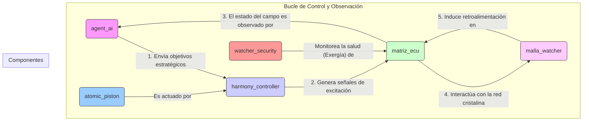

# Watchers: Un Ecosistema de IA para la Orquestación Armónica de Sistemas Complejos

*"Inspirado en los principios de la Cimática y la Topología Algebraica para construir sistemas resilientes, autoconscientes y eficientes."*

[](https://github.com/gerardo/watchers_refined/actions/workflows/ci.yml)
[](https://github.com/astral-sh/ruff)

## 1. Visión General

**Watchers** es un ecosistema de microservicios diseñado para la orquestación y el control de sistemas complejos. Nuestra misión es evolucionar desde un conjunto de agentes de IA especializados hacia una **plataforma de infraestructura de IA abierta y robusta**.

El proyecto se fundamenta en la unificación de dos dominios científicos:
*   **Cimática:** El estudio de la forma visible de la vibración, que usamos como metáfora para modelar la dinámica de un sistema como un campo energético.
*   **Topología Algebraica:** La rama de las matemáticas que estudia las propiedades estructurales de las formas, que usamos para dotar al sistema de "autoconciencia" arquitectónica.

La visión a largo plazo es convertir las capacidades internas de Watchers en una plataforma comercial que ofrezca la "plomería" esencial para una nueva generación de sistemas de IA agénticos, capitalizando la migración de valor desde las aplicaciones hacia la infraestructura que las soporta.

## 2. Principios Fundamentales

### 2.1. Cimática: La Física de la Vibración

Entendemos la dinámica de un sistema como un campo vibratorio. El objetivo es identificar y mantener "modos normales" —estados de operación armónicos, estables y eficientes— y utilizar intervenciones controladas, análogas a frecuencias de resonancia, para guiar el sistema hacia estos estados deseados y evitar transiciones caóticas.

### 2.2. Topología Algebraica: La Conciencia Estructural

La arquitectura del sistema es autoconsciente. Utilizamos functores y la teoría de categorías para construir invariantes topológicos que permiten al ecosistema comprender su propia estructura de interacciones. Esto garantiza la coherencia, previene estados inválidos y dota al sistema de una resiliencia sin precedentes. La **Matriz de Interacción Central (MIC)** es la manifestación concreta de esta conciencia arquitectónica.

Para una inmersión profunda en la arquitectura y las ecuaciones gobernantes, consulta **[docs/ARCHITECTURE.md](docs/ARCHITECTURE.md)**.

## 3. Arquitectura y Flujo de Interacción

El sistema se compone de varios microservicios especializados que colaboran en bucles de retroalimentación continuos.



## 4. Entorno de Desarrollo

### 4.1. Filosofía de Herramientas

Este proyecto adopta un enfoque moderno y de alto rendimiento para el desarrollo en Python, utilizando herramientas de última generación escritas en Rust.

*   **`uv` para la Gestión de Paquetes y Entornos:** `uv` reemplaza a `pip`, `venv`, `virtualenv` y `pip-tools` con un único binario ultrarrápido. Su velocidad (entre 10x y 100x más rápido) y su caché global inteligente nos permiten crear entornos "efímeros" de forma instantánea, mejorando drásticamente la reproducibilidad y la eficiencia. Es el "Cargo para Python".

*   **`Ruff` para Linting y Formateo:** `Ruff` reemplaza a `Flake8`, `Black`, `isort` y docenas de sus plugins. Es una herramienta integral que es entre 10x y 100x más rápida que sus predecesoras. Su velocidad permite una retroalimentación casi instantánea en el editor, transformando el linting de una tarea de CI a un asistente en tiempo real.

Esta elección de herramientas no es solo una mejora de rendimiento, sino un cambio de paradigma que simplifica radicalmente nuestros flujos de trabajo.

### 4.2. Instalación

1.  **Instala `uv`:**
    ```bash
    curl -LsSf https://astral.sh/uv/install.sh | sh
    ```

2.  **Crea el entorno virtual e instala las dependencias (un solo comando):**
    ```bash
    uv venv && uv pip sync requirements-dev.txt
    ```

3.  **Activa el entorno:**
    ```bash
    source .venv/bin/activate
    ```

### 4.3. Comandos Comunes

*   **Verificar Linting y Formato:**
    ```bash
    ruff check .
    ```
*   **Corregir Linting y Formatear Código:**
    ```bash
    ruff format . && ruff check . --fix
    ```
*   **Ejecutar Pruebas:**
    ```bash
    pytest
    ```

## 5. Cómo Contribuir

¡Las contribuciones son bienvenidas! Si estás interesado en mejorar Watchers, por favor revisa nuestro `ARCHITECTURE.md` para entender los fundamentos.

## 6. Licencia

Este proyecto está licenciado bajo la Licencia MIT. Puedes encontrar los detalles completos en el archivo [LICENSE](LICENSE).