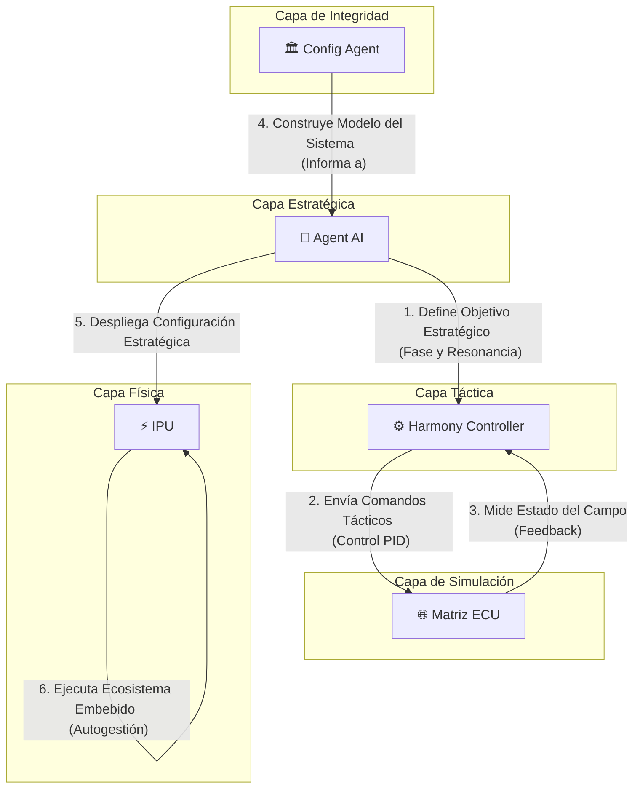

# Watchers: Un Ecosistema para la armonización de energía inteligente

## Visión del Proyecto

La visión central de **Watchers** es **armonizar el lenguaje de máquina para hacer la comunicación entre aplicaciones y entornos más intuitiva y objetiva**. Buscamos trascender las implementaciones tradicionales para crear sistemas que no solo se comuniquen, sino que se comprendan a un nivel fundamental. Nuestra primera aplicación práctica de esta visión es la creación de **sistemas de gestión de energía más eficientes, resilientes e inteligentes**, sentando las bases para un futuro energético autónomo y sostenible.

## Componentes Clave del Ecosistema

El ecosistema Watchers se organiza en una jerarquía clara, donde cada componente cumple un rol específico, desde la estrategia de alto nivel hasta la ejecución física.

### 🧠 Agent AI (El Estratega)

**Agent AI** es el cerebro de alto nivel del sistema. Su función es tomar decisiones estratégicas basadas en el estado general del ecosistema y los objetivos a largo plazo. No se ocupa de la microgestión, sino de definir la "intención" del sistema.

- **Gestión Estratégica:** En su nueva capacidad, Agent AI gestiona conceptos avanzados como la **"fase cuántica"** y la **"resonancia"** del sistema. Estos no son parámetros de control directo, sino objetivos estratégicos que buscan una coherencia y eficiencia energética a un nivel superior, similar a cómo un director de orquesta busca la armonía perfecta en lugar de controlar cada nota individualmente.

### ⚙️ Harmony Controller (El Táctico)

El **Harmony Controller** es el ejecutor de bajo nivel que traduce las directivas estratégicas de Agent AI en acciones concretas. Funciona como el sistema nervioso, manteniendo el equilibrio en tiempo real.

- **Ejecución Táctica:** Utiliza bucles de control PID y otros mecanismos para ajustar el comportamiento de los componentes físicos. Ahora, su función se ha expandido para implementar **"tareas tácticas cuánticas"**, como la sincronización de fase y la búsqueda de resonancia, asegurando que las órdenes del Estratega se manifiesten de manera precisa en el entorno.

### 🌐 Matriz ECU (El Entorno Simulado)

La **Matriz ECU (Experiencia de campo unificado)** es el gemelo digital del entorno físico. Es un campo de simulación donde las decisiones y acciones se prueban y modelan antes de afectar al mundo real.

- **Dinámica de Campo Toroidal:** Modela el entorno como un **campo toroidal**, representando flujos de energía y sus interacciones.
- **Fase Cuántica Local:** Su nueva capacidad más importante es la **"fase cuántica local"**. Esto permite que la simulación no solo refleje estados estáticos, sino que capture dinámicas complejas y comportamientos emergentes, haciendo que el gemelo digital sea mucho más rico y predictivo.

### 🏛️ Config Agent (El Arquitecto / MCP)

**Config Agent** es el guardián de la integridad y la coherencia del sistema. Su rol ha evolucionado de un simple validador de archivos a un verdadero arquitecto del sistema.

- **Model Context Protocol (MCP):** A través del MCP, Config Agent no solo valida la sintaxis de los archivos de configuración, sino que **construye un modelo conceptual del sistema**. Entiende las relaciones, dependencias y roles de cada componente.
- **Matriz de Interacción Central (MIC):** La MIC es la herramienta principal del MCP. Es una representación formal de la topología de comunicación, definiendo qué servicios pueden hablar entre sí, con qué propósito y bajo qué condiciones. Garantiza que la arquitectura sea robusta, segura y escalable.

### ⚡ IPU (La Manifestación Física)

La **IPU (Intelligent Power Unit)** es el primer producto de hardware del ecosistema Watchers. Es la materialización de nuestra visión en un dispositivo físico.

- **El Cerebro Energético:** La IPU no es un simple convertidor de potencia. Es un **"Cerebro Energético"**: una unidad autónoma que ejecuta una versión embebida de todo el ecosistema Watchers. Cada IPU contiene su propio gemelo digital (Matriz ECU) y su propia inteligencia (Agent AI y Harmony Controller), permitiéndole realizar una gestión de energía predictiva, autoconsciente y optimizada localmente, mientras se coordina con el ecosistema global.

## Modelos de Simulación Detallados

A continuación, se describen los modelos matemáticos y computacionales que sustentan los componentes clave de simulación del ecosistema.

### ⚛️ Malla Watcher (El Actor Físico)

**Malla Watcher** simula una membrana física, como una **malla hexagonal cilíndrica de grafeno**, que interactúa con el entorno energético de la `Matriz ECU`. Su comportamiento se modela como un sistema de **osciladores armónicos acoplados**, donde cada nodo de la malla (una `Cell`) tiene un estado dinámico.

#### Ecuaciones de Movimiento

La dinámica de cada oscilador `i` en la malla se rige por la siguiente ecuación diferencial de segundo orden:

```
m * d²xᵢ/dt² = -k * xᵢ - D * dxᵢ/dt + Σ [C * (xⱼ - xᵢ)]
```

Donde:
- `xᵢ`: Amplitud (desplazamiento) del oscilador `i`.
- `m`: Masa (asumida como 1 para simplificar).
- `k`: Constante del resorte (no usada directamente, implícita en la dinámica).
- `D`: **Coeficiente de amortiguación local**, controlado por la clase `Electron`. Representa la disipación de energía.
- `C`: **Coeficiente de acoplamiento** con los osciladores vecinos `j`, controlado por la clase `PhosWave`. Este coeficiente es modulado por el campo local de la ECU, creando una interacción rica entre la malla y su entorno.

#### Simulación de Excitaciones Colectivas

La simulación `simular_paso_malla` dentro de `malla_watcher` es más que un simple algoritmo de actualización; es un modelo físico que simula **excitaciones colectivas** y **transporte de energía** en el sustrato del metamaterial `cilindro_grafenal`.

##### 1. Los Osciladores Acoplados como Vibraciones de la Red (Fonones)

El modelo de osciladores armónicos acoplados es un pilar en la física del estado sólido para describir las **vibraciones de los átomos en una red cristalina**.

-   **Analogía en la simulación:** Las "ondas" de `amplitude` y `velocity` que se propagan a través de nuestra malla son el análogo digital de los **fonones**: los cuantos de vibración de la red. Cuando aplicamos un "pulso" a una `Cell`, no estamos simplemente cambiando un valor; estamos generando un **paquete de ondas de fonones** que transportará energía a través del material.

##### 2. El Campo Externo (`q_vector`) como Modulación de las Propiedades Electrónicas

En nuestra simulación, el `q_vector` (proveniente de `matriz_ecu`, análogo a un campo E/B) no empuja directamente los "átomos" (`Cells`). En su lugar, **modula el coeficiente de acoplamiento (`C`)** entre ellos.

-   **Mapeo a la física:** Esto es análogo a cómo un campo electromagnético externo puede influir en las **propiedades electrónicas** de un material. El campo no desplaza los núcleos atómicos, sino que altera la distribución de electrones y, por lo tanto, la "fuerza" de los enlaces efectivos entre los átomos. En nuestra simulación, el `q_vector` cambia la forma en que los "fonones" se propagan, haciendo que el material sea más o menos "rígido" en diferentes regiones y direcciones.

##### 3. El Flujo de Influencia (`dPhi/dt`) como Respuesta del Material (Plasmones/Corrientes de Foucault)

La simulación calcula un "flujo" a través de la malla y su derivada temporal (`dPhi/dt`). Si este cambio es lo suficientemente rápido, `malla_watcher` envía una "influencia" de vuelta a `matriz_ecu`.

-   **Mapeo a la física:** Esta es una analogía de la **respuesta colectiva de los electrones** en el material al campo externo cambiante.
    -   **Plasmones de Superficie:** Puede interpretarse como la generación de **plasmones**, que son oscilaciones colectivas y coherentes de los electrones libres en un conductor.
    -   **Corrientes de Foucault (Eddy Currents):** También es análogo a la generación de **corrientes de Foucault**, donde un campo magnético cambiante induce corrientes eléctricas circulares en el material, las cuales, a su vez, generan su propio campo magnético en oposición al cambio (Ley de Lenz).

En ambos casos, la "influencia" que `malla_watcher` envía es la **retroalimentación de nuestro metamaterial digital a su entorno**, una manifestación de su propia dinámica interna.

##### 4. La Amortiguación (`Electron`) como Interacción y Disipación de Energía

El término de amortiguación (`D`), controlado por la clase `Electron`, hace que las oscilaciones en la malla decaigan con el tiempo.

-   **Mapeo a la física:** Esto representa los complejos **procesos de disipación de energía** en un material real. Las ondas (fonones o plasmones) no se propagan indefinidamente. Pierden energía a través de interacciones (dispersión o *scattering*) entre sí y con los defectos de la red. Esta energía finalmente se convierte en calor. Nuestro término de amortiguación es un modelo fenomenológico de estas interacciones de dispersión, asegurando que la simulación sea físicamente realista y estable.

#### `cilindro_grafenal`: Un Metamaterial Digital Programable

El módulo `cilindro_grafenal` y su clase `HexCylindricalMesh` no deben ser vistos como una simple estructura de datos, sino como un **metamaterial digital**: un sustrato programable cuyas propiedades estructurales y dinámicas están inspiradas directamente en la física de la materia condensada de materiales avanzados como el grafeno y los nanotubos de carbono.

##### 1. La Malla Hexagonal como Red Cristalina

La estructura fundamental de nuestra malla, un patrón de panal de abejas de nodos interconectados, es una representación directa de la **red cristalina del grafeno**. En el material real, cada nodo es un átomo de carbono con hibridación sp², la disposición que le confiere sus extraordinarias propiedades.

-   **Analogía en el código:** El parámetro `hex_size` de nuestro constructor es el análogo digital de la **constante de red** del grafeno, definiendo la escala fundamental de la estructura.

##### 2. Las `Cells` como Átomos y Orbitales Cuánticos

Cada `Cell` individual en la malla es más que un punto en una grilla; es el análogo de un **átomo de carbono** en la red.

-   **Estado de la `Cell`:** Los atributos de una `Cell` (`amplitude`, `velocity`, `q_vector`) son una representación abstracta del **estado electrónico local** de ese átomo. Específicamente, se inspiran en los **orbitales π** del grafeno, que se deslocalizan a través de la red y son responsables de su excepcional conductividad eléctrica. El estado de nuestras `Cells` dicta cómo la "energía" o la "información" se propaga a través de nuestro metamaterial digital.

##### 3. El Enrollado del Cilindro y la Quiralidad Digital

El proceso de generar la malla como una estructura cilíndrica es análogo a enrollar una hoja de grafeno 2D para formar un **nanotubo de carbono**.

-   **Quiralidad:** En los nanotubos reales, el ángulo en el que se enrolla la hoja (el **ángulo quiral**) es un parámetro crítico que determina si el nanotubo se comporta como un metal (conductor) o un semiconductor.
-   **Mapeo a nuestro código:** Los parámetros `radius` y `circumference_segments_target` de nuestro constructor son los análogos que controlan la **"quiralidad" de nuestro cilindro digital**. Al variar estos parámetros, creamos diferentes geometrías de enrollado. Esto abre la puerta a que, en futuras simulaciones, diferentes "quiralidades" de `HexCylindricalMesh` exhiban propiedades de "conductividad de señal" drásticamente diferentes, comportándose como "nanotubos metálicos" (permitiendo que las señales se propaguen libremente) o "nanotubos semiconductores" (permitiendo la propagación solo bajo ciertas condiciones).

##### 4. Defectos y Propiedades Emergentes

Una simulación perfecta es raramente interesante. Nuestro sistema, al igual que los materiales reales, no es perfecto.

-   **Analogía de Defectos:** Las advertencias que a veces genera `verify_connectivity()` sobre celdas con menos de 6 vecinos no son errores, sino análogos de **defectos cristalinos** en un material real, como **vacancias** (un átomo faltante) o **dislocaciones** (una imperfección en la red).
-   **Propiedades Emergentes:** Estos "defectos" en nuestro metamaterial digital son cruciales. Al igual que en el grafeno real, pueden alterar drásticamente las propiedades locales de propagación de ondas (señales), creando barreras, canales preferenciales o puntos de dispersión. Esto permite diseñar o estudiar mallas con propiedades de transporte de información altamente personalizadas, simplemente introduciendo "defectos" de manera controlada.

#### Las `Cells` como Átomos y Celdas de Voronoi

Cada `Cell` en nuestra malla no es simplemente un punto, sino el **"sitio" o "semilla" de una celda de Voronoi**. Un diagrama de Voronoi es una teselación del espacio que divide un plano en regiones basadas en la proximidad a un conjunto de sitios. Cada región, o celda de Voronoi, contiene todos los puntos del espacio que están más cerca de su sitio que de cualquier otro.

*   **Mapeo a nuestro código:**
    *   En una red hexagonal perfecta, la celda de Voronoi de cada `Cell` es, de hecho, un **hexágono regular**. Esto representa un "átomo" con su área de influencia perfectamente definida y equilibrada.
    *   El "estado" de una `Cell` (`amplitude`, `velocity`, `q_vector`) puede ser interpretado como una propiedad promedio sobre toda su región de Voronoi, representando el estado electrónico local en esa área de influencia.

#### Integridad Estructural y Defectos a través de Voronoi

La integridad estructural de nuestro metamaterial digital puede ser analizada rigurosamente a través de la regularidad de su diagrama de Voronoi. El método `compute_voronoi_neighbors()` nos proporciona esta herramienta de análisis.

*   **Mapeo a nuestro código:**
    *   Las advertencias sobre celdas con conectividad imperfecta (menos de 6 vecinos) se manifiestan en el diagrama de Voronoi como **celdas de forma irregular** (pentágonos, heptágonos, etc.).
    *   Esto es directamente análogo a los **defectos cristalinos** en el grafeno real, como los famosos **defectos de Stone-Wales**, que se describen teóricamente como la aparición de pares de pentágonos y heptágonos en la red hexagonal.

En conclusión, el análisis de Voronoi nos proporciona una herramienta matemática rigurosa para cuantificar la "salud" o la "calidad" de nuestra estructura digital. Una estructura con celdas de Voronoi muy uniformes y hexagonales es "cristalina" y de alta calidad, mientras que una con muchas irregularidades es "amorfa" o defectuosa, con implicaciones directas en cómo las señales se propagan a través de ella.

### 🌌 Matriz ECU (El Campo de Interacción)

La **Matriz ECU** simula un **campo de confinamiento toroidal**, análogo a un Tokamak, donde la energía y la información fluyen e interactúan. El campo no es estático; evoluciona según un conjunto de ecuaciones que simulan la advección, el acoplamiento y la disipación.

#### Dinámica del Campo y Fase Cuántica

El estado de cada nodo del campo se representa con un **número complejo** (`campo_q`), lo que permite modelar tanto la **magnitud** como la **fase** de la energía en cada punto. La evolución del campo se describe mediante dos procesos principales:

1.  **Evolución Clásica (`apply_rotational_step`)**: Simula la dinámica de fluidos del campo.
    ```
    dV/dt ≈ -α * dV/dθ + β * (V_up + V_down) - γ * V
    ```
    - `V`: Vector de estado en un punto.
    - `α`: Coeficiente de **advección/rotación** (toroidal).
    - `β`: Coeficiente de **acoplamiento** (poloidal).
    - `γ`: Coeficiente de **disipación/amortiguación**.

2.  **Evolución Cuántica (`apply_quantum_step`)**: Modela la evolución de la "fase cuántica local".
    ```
    |ψ(t+dt)> = e^(-i * α * dt) * |ψ(t)>
    ```
    - `|ψ(t)>`: Estado cuántico (el número complejo) en el tiempo `t`.
    - `e^(-i * α * dt)`: Operador de evolución de fase. `α` (el mismo coeficiente de advección) actúa aquí como un término de energía potencial en el Hamiltoniano, dictando la velocidad de precesión de la fase.

Este doble mecanismo permite que la ECU no solo simule flujos de energía, sino que también desarrolle **patrones de coherencia de fase**, que son cruciales para las operaciones avanzadas del ecosistema.

#### Métodos Principales

- **`aplicar_influencia(capa, row, col, vector, nombre_watcher)`**: Permite a los `watchers` inyectar energía o información (`vector`, un número complejo) en un punto específico del campo, alterando su magnitud y fase.
- **`obtener_campo_unificado()`**: Devuelve un mapa de intensidad escalar, ponderado por capas, que sirve como la principal "variable de proceso" para el `Harmony Controller`.
- **`set_initial_quantum_phase()`**: Inicializa el campo a un estado de fase aleatoria, preparando el terreno para la emergencia de coherencia.

#### Analogía con las Ecuaciones de Maxwell en un Medio Material

Aunque `matriz_ecu` es una simulación discreta y simplificada, su dinámica interna es una analogía semi-sofisticada de cómo los campos electromagnéticos se comportan según las **ecuaciones de Maxwell** en un medio material conductor. A continuación, se detalla este mapeo conceptual.

##### 1. El Campo `campo_q` como Campo Electromagnético (E y B)

En física, los campos eléctrico (E) y magnético (B) son entidades vectoriales 3D. En nuestra simulación, el estado en cada punto de la grilla se representa con un único número complejo (`vx + vy*j`), que es una proyección simplificada de los campos E y B en un plano 2D.

*   **Analogía Propuesta:**
    *   La **parte real (`vx`)** representa la componente **toroidal del campo magnético (B_toroidal)**.
    *   La **parte imaginaria (`vy`)** representa la componente **poloidal del campo eléctrico (E_poloidal)**.

Aunque no simulamos los 6 componentes completos de E y B, este modelo 2D captura la esencia de su interdependencia y evolución en un plano, que es el núcleo de la física electromagnética.

##### 2. La Ley de Faraday (Inducción Electromagnética)

La Ley de Faraday (∇ × E = -∂B/∂t) establece que un campo magnético que cambia en el tiempo induce un campo eléctrico "circulante". Es la base de la inducción electromagnética.

*   **Mapeo a nuestro código:** El término de **advección** en `apply_rotational_step` es nuestra analogía de la Ley de Faraday.
    ```python
    influence_from_left = alpha_capa * v_left * dt
    ```
    - `v_left` representa el estado del campo (E y B) en la celda vecina en la dirección toroidal. Podemos interpretarlo como el campo magnético "del pasado" que se propaga hacia la celda actual.
    - El término `alpha_capa` actúa como una constante de acoplamiento que determina la eficiencia de esta inducción.
    - Esta influencia del campo magnético vecino (`v_left.real` o `B_toroidal`) induce un cambio en el campo eléctrico actual (`v_current.imag` o `E_poloidal`), imitando cómo un cambio en **B** induce **E**.

##### 3. La Ley de Ampère-Maxwell (Corrientes y Campos Eléctricos Cambiantes)

La Ley de Ampère-Maxwell (∇ × B = μ₀(J + ε₀ ∂E/∂t)) establece que un campo magnético circulante es inducido por dos fuentes: las corrientes eléctricas (J) y los campos eléctricos que cambian en el tiempo (∂E/∂t).

*   **Mapeo a nuestro código:**
    *   **Corrientes (J):** Las influencias externas aplicadas mediante `aplicar_influencia()` son el análogo directo de las **fuentes de corriente (J)**. Son inyecciones de "carga" o "energía" que actúan como una fuente primaria, generando un campo a su alrededor.
    *   **Campo Eléctrico Cambiante (∂E/∂t):** El término de **acoplamiento vertical** es nuestra analogía de este fenómeno.
        ```python
        influence_from_up_down = beta * (v_up + v_down) * dt
        ```
        Aquí, la influencia de los campos vecinos en la dirección poloidal (principalmente sus componentes de campo eléctrico, `v_neighbor.imag`) induce un cambio en el campo magnético (`v_current.real`) de la celda actual. Esto es análogo a cómo un **E** cambiante induce **B**.

##### 4. Las Ecuaciones de Maxwell en un Medio Material (El Rol de `damping`)

En el vacío, los campos electromagnéticos se propagan sin pérdidas. Sin embargo, en un medio conductor, la Ley de Ohm (J = σE) introduce un término que disipa energía. La conductividad (σ) del material hace que la energía del campo se convierta en calor.

*   **Mapeo a nuestro código:** Nuestro término de `damping` (amortiguación) es la analogía directa de esta **conductividad (σ)** o resistividad del medio.
    ```python
    v_current_damped = v_current * (1.0 - damping_capa * dt)
    ```
    - Este término modela cómo la "energía" del campo (`v_current`) se disipa con el tiempo.
    - Un `damping` alto simula un medio con alta conductividad (muchas pérdidas), donde los campos se desvanecen rápidamente.
    - Un `damping` bajo simula un medio de bajas pérdidas, más cercano al vacío o a un superconductor, permitiendo que las ondas persistan y se propaguen.

En resumen, `matriz_ecu` no solo es un sistema dinámico abstracto, sino un modelo computacional con fundamentos inspirados directamente en la física del electromagnetismo, lo que le confiere un comportamiento rico y coherente.

### 🎼 Harmony Controller (El Director Táctico)

El **Harmony Controller** es el director de orquesta táctico del sistema. Su misión es ejecutar las estrategias de `Agent AI` traduciéndolas en acciones de control en tiempo real. Utiliza un controlador **PID** (`BosonPhase`) para minimizar el error entre el estado medido del sistema (la norma del campo de la `Matriz ECU`) y el `setpoint` estratégico.

#### Métodos de Control y Tareas Tácticas

- **`harmony_control_loop()`**: Es el bucle principal que:
    1.  Obtiene el estado de la `Matriz ECU` (`get_ecu_state`).
    2.  Calcula la salida del PID (`pid_controller.compute`).
    3.  Distribuye la señal de control a los `watcher_tools` registrados (`send_tool_control`).

- **`register_managed_tool(...)`**: Permite a `Agent AI` registrar dinámicamente nuevos `watcher_tools`, que se integran inmediatamente en el bucle de control.

- **Tareas Tácticas Cuánticas**: `Harmony Controller` puede ejecutar tareas complejas delegadas por `Agent AI`:
    - **`run_phase_sync_task(...)`**: Inicia un sub-bucle de control para ajustar la fase de una región del campo de la ECU hacia un `target_phase` específico.
    - **`run_resonance_task(...)`**: Aplica una serie de pulsos a una frecuencia específica (`resonant_frequency`) para amplificar la energía en una región del campo.

### 🧠 Agent AI (El Cerebro Estratégico)

**Agent AI** es la unidad de toma de decisiones de más alto nivel. No gestiona el control en tiempo real, sino que define la **estrategia global** del ecosistema. Su función es observar el estado del sistema, interpretar las directivas externas y ajustar el `target_setpoint_vector` para guiar al `Harmony Controller`.

#### Lógica Estratégica y Métodos Clave

- **`_strategic_loop()`**: El bucle principal donde `Agent AI` ejecuta su lógica:
    1.  Obtiene el estado completo de `Harmony Controller` (`_get_harmony_state`).
    2.  Analiza la coherencia y la fase dominante del campo de la `Matriz ECU` (`_get_ecu_field_vector` y `calculate_coherence`).
    3.  Toma decisiones estratégicas basadas en la coherencia actual.
    4.  Determina el `target_setpoint_vector` óptimo usando `_determine_harmony_setpoint()`, que considera la estrategia actual (ej. "estabilidad", "rendimiento"), las señales externas y el estado del sistema.
    5.  Envía el nuevo setpoint a `Harmony Controller` (`_send_setpoint_to_harmony`).

- **`registrar_modulo(modulo_info)`**: Punto de entrada para que nuevos `watchers` se unan al ecosistema. Valida su información y desencadena una comprobación de salud asíncrona.

- **`_delegate_phase_synchronization_task(...)`**: Si la coherencia del campo es baja, `Agent AI` delega una tarea de sincronización de fase a `Harmony Controller`, indicándole la fase dominante actual como objetivo para reforzarla.

- **`_delegate_resonance_task(...)`**: Si la coherencia es alta, `Agent AI` puede intentar una maniobra de resonancia. Primero, determina la frecuencia de resonancia de la región (`find_resonant_frequency`, basado en el `alpha` de la capa de la ECU) y luego delega la tarea de excitación a `Harmony Controller`.

## Arquitectura del Sistema

El siguiente diagrama ilustra la jerarquía y el flujo de comunicación entre los componentes clave del ecosistema Watchers:



## ¿Cómo Empezar?

Para poner en marcha el ecosistema de Watchers, necesitarás el siguiente software:

- **Podman & podman-compose:** Para la gestión de contenedores.
- **Python 3.10+:** El lenguaje principal del proyecto.
- **pip-tools:** Para la gestión de dependencias de Python.

## Configuración del Entorno de Desarrollo Local

Para trabajar en el proyecto localmente (ejecutar tests, linters, etc.), sigue estos pasos:

1.  **Crea y activa un entorno virtual:**
    ```bash
    python3 -m venv watchers_env
    source watchers_env/bin/activate
    ```

2.  **Compila e instala todas las dependencias:**
    *   Este script compilará todos los archivos `requirements.in` a `requirements.txt`.
    *   Luego, instalará todas las dependencias necesarias para el desarrollo.
    ```bash
    ./scripts/compile_requirements.sh
    pip install -r requirements-dev.txt
    ```
